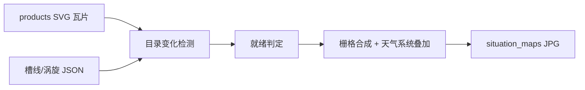

# SVG 合成天气形势图

确认范围：只生成 **200 / 500 / 850 / 925 hPa** 四类图（不生成 1000hPa 与地面）。脚本独立运行，不接入现有 PM2 调度。

## 数据流



- SVG 底图来自已有瓦片：[`src/draw/generate_svg_layers.py`](src/draw/generate_svg_layers.py) 输出的 `{products}/{init_time}/{fc_hour}/{level}/{layer_type}/{z}/{x}/{y}.svg`
- 天气系统来自 JSON，**不在 SVG 里**，需按前端 Canvas 逻辑叠加
- 输出：`{output_root}/{init_time}/situation_maps/{region}/{level}hPa_{fc_hour}.jpg`  
  例如 `data/2026062900/situation_maps/china/500hPa_024.jpg`

## 产品配方（对齐 prompt + vis_web）

| 层次 | SVG 图层（由底到顶） | 天气系统 | 过滤 |
|------|----------------------|----------|------|
| 500 | `hght_contour`（含 586/588 填色）→ `wind_barb` | 槽线 + 涡旋中心 | 槽线 `avg_wind_speed≥3`，仅 `shear_v_up`/`shear_v_down`；中心 `vort≥0.00006` |
| 850 | `hght_contour` → `wind_barb` | 槽线 + 涡旋中心 + 轨迹 | 槽线 `avg_wind_speed≥3`，仅 `shear_u_left`/`shear_u_right`；中心 `vort≥0.00006`（与前端默认一致） |
| 925 | 同 850 | 同 850 | 同 850 |
| 200 | `wind_speed_fill` → `hght_contour` → `wind_barb` | 槽线 + 涡旋中心 | 同 500；200hPa 另加高空风速色标 |

切变开关与 [`LEVEL_SHEAR_DEFAULTS`](vis_web/src/composables/weatherView/constants.js) 一致；阈值与 [`useWeatherViewState.js`](vis_web/src/composables/weatherView/useWeatherViewState.js) 默认值一致（槽线 3 m/s、中心涡度 `0.00006`）。

轨迹（仅 850/925）：只保留暖心轨迹，且当前 `fc_hour` 落在轨迹 `[initStep, endStep]` 内。静态图绘制**完整路径**：历史实线、未来虚线（对应前端渲染能力，而不是 UI 默认的「仅未来」）。

## 三个范围与 SVG 层级

裁剪范围按 prompt 固定经纬度（不再从前端 center/k 反推）：

- **中国**：80–150°E，0–50°N → **z=0**（对应前端「中国」视图 `k≈3≤5`）
- **华南**：100–125°E，15–30°N → **z=2**（对应前端「华南」`k≈10>8`）
- **广东**：109–118°E，20–26°N → **z=2**（对应前端「广东」`k≈20>8`）

SVG 层级仍按前端 [`tileZoomForView`](vis_web/src/composables/weatherView/multiMapResolution.js)（`k≤5→z=0`，`k>8→z=2`），与同名视图一致；出图 extent 用上表，不用 `DEFAULT_MAP_VIEWS` 的中心点。

瓦片选取复用 [`iter_tiles`](src/draw/svg_layer_geometry.py)：
- `wind_barb` 用该范围对应的 z
- `hght_contour` / `wind_speed_fill` 仅有 z=0 全幅瓦片，合成时按范围裁剪（与前端 `MULTI_Z_LAYER_TYPES` 行为一致）

## 合成与绘图风格

用 Cartopy `PlateCarree` 出图（与瓦片投影一致），风格贴近现有 [`trough.py`](src/trough.py) 气象图：海岸线、国界、经纬网格、标题、色标。

绘制顺序对齐前端 [`useMapRenderer.js`](vis_web/src/composables/weatherView/useMapRenderer.js)：
1. 填色 SVG（200hPa 风速；500hPa 高度场视为 fill）
2. 海岸线 / 国界 / 网格
3. 非填色 SVG（等值线、风羽）
4. 槽线 `#8B4513`，圆角线
5. 涡旋轨迹：暖心 `#f97316` 线宽略粗，未来段虚线 + 箭头
6. 涡旋中心红色 **L**
7. 色标：200hPa 用 [`BOUND_WIND_HIGH` / `CLRMAP_WIND_HIGH`](src/draw/svg_layer_rendering.py)；500hPa 附 586/588 dagpm 填色说明

SVG → 栅格：新增 `pillow` + `cairosvg`（透明背景）。Linux 生产需系统包 `libcairo2`；Windows 若 cairo 不可用，用 PyMuPDF (`fitz`) 作为栅格化回退。

## 目录变化检测（独立常驻）

不改 [`src/draw_schedule.py`](src/draw_schedule.py) / [`src/schedule.py`](src/schedule.py)。新脚本自己轮询（避免引入 `watchdog`，Windows/Linux 行为一致）：

1. 扫描 `products/{init_time}/{fc_hour}/{level}/` 与 `{init_time}/trough_data|vortex_centers|vortex_tracks/`
2. 某 `(init_time, fc_hour, level, region)` 所需 SVG 瓦片 + JSON 均存在，且 mtime 稳定超过 debounce（默认 15s）后入队
3. 已有 JPG 且源文件未更新则跳过（增量，与 SVG `--skip-existing` 同语义）
4. JSON 未就绪时只等、不报失败（槽线/涡旋流水线与 SVG 调度时刻不同）

CLI：

```bash
uv run python src/draw/generate_situation_maps.py --watch
uv run python src/draw/generate_situation_maps.py --once --init-time 2026062900
```

## 新增文件

- [`src/draw/situation_map_config.py`](src/draw/situation_map_config.py)：产品配方、区域固定 bounds + z、过滤阈值、前端对齐的颜色/线宽
- [`src/draw/situation_map_composite.py`](src/draw/situation_map_composite.py)：瓦片选取、SVG 栅格、叠加、色标、写 JPG
- [`src/draw/generate_situation_maps.py`](src/draw/generate_situation_maps.py)：CLI + 轮询入口
- [`tests/test_situation_maps.py`](tests/test_situation_maps.py)：过滤、z 选择、就绪判定、跳过已存在；用临时目录 + 假 SVG/JSON，不访问 THREDDS

依赖：`pyproject.toml` 增加 `pillow`、`cairosvg`（可选 `pymupdf` 作 Windows 回退）。

## 验证

- `uv run python -m py_compile src/draw/situation_map_config.py src/draw/situation_map_composite.py src/draw/generate_situation_maps.py`
- `uv run python -m unittest tests.test_situation_maps`
- 若本地 `data/products/` 有现成时次，用 `--once --init-time ...` 抽一张 500hPa 中国图，核对风羽密度（z=0）、槽线切变类型、L 标记与色标
